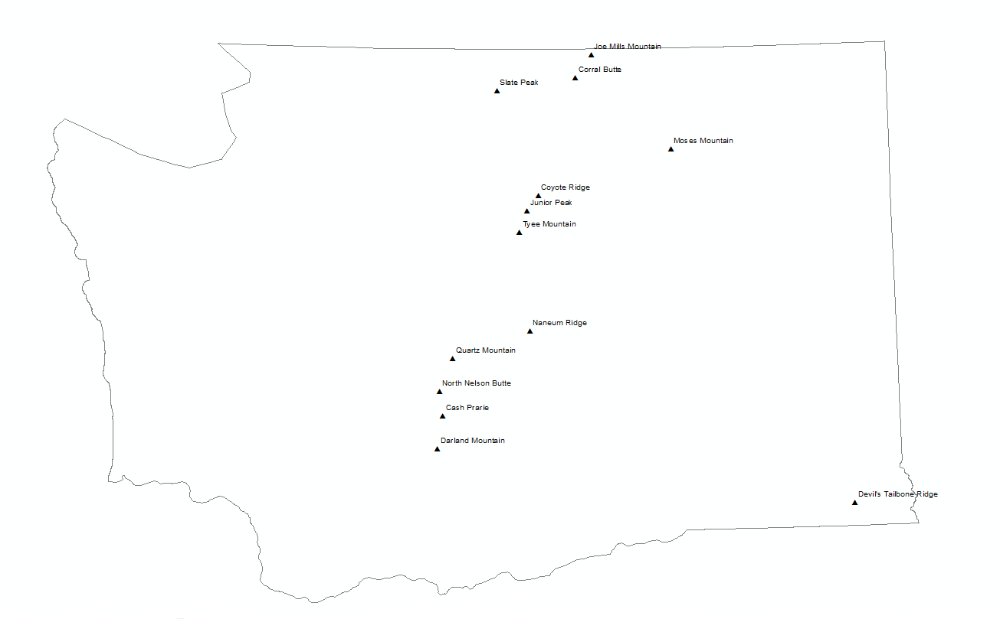
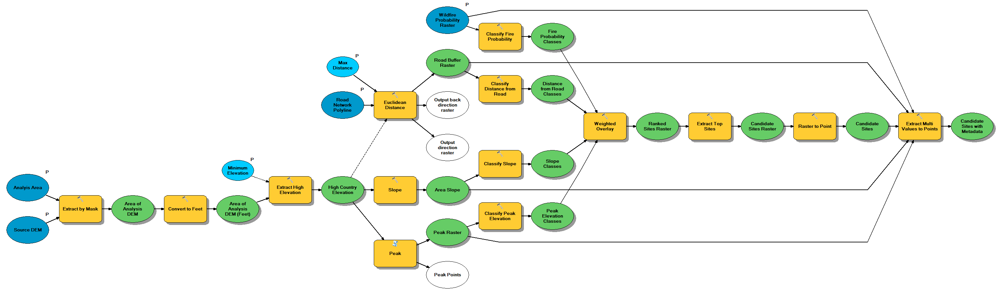

# Modeling a Fast-response AI Wildfire Camera Network in Washington State 

## Introduction

This GIS project was completed as a capstone project in the [UC Davis GIS Certificate Program](https://cpe.ucdavis.edu/section/geographic-information-systems-gis-specialization-coursera).   This project models a real-world GIS analysis scenario in which a question or theory is developed, data sources are identified, a processing model is developed, and a conclusion with final map and data artifacts are generated.

For this project, the question asked was:

***Where in Washington State should 10-20 fast-response wildfire cameras be placed in order to test and prove this new technology platform in preparation for a wider rollout?***

This suitability analysis takes into consideration the following:

1. Maximizing viewshed by finding peaks
2. Minimizing distance to existing road networks.
3. Minimizing slope to find acceptable tower construction sites.
4. Maximizing effectiveness by targeting medium to high risk wildfire regions.

## Background

Wildfire activity in the western United States continues to increase in frequency and magnitude.   Today's larger and more intense fires are more difficult to manage than in years past.   According to the US Congressional Research Service, the average number of acres burned per year has risen to 7.0 million acres annually.   The figure is more than double the average annual acreage burned in the 1990s.

One silver lining is that technology is developing which promises to help identify wildfires when they are extremely young.   If a fire can be identified within minutes to several hours after ignition, often a rapid-strike approach can be used to fully contain the fire before it grows and requires a broader response.   This could fundamentally change the way we fight wildfires.  This technology includes:

1. High resolution visible band and infrared band cameras which can capture small, distant fires via smoke plume identification or radiation detection.

2. High-speed wireless data networks such as SpaceX's Starlink or terrestrial-based 5G networks provided by companies such as TMobile, Verizon,  AT&T, and others.   Point-to-point microwave, while not a new technology, has dropped in price considerably as well and should also be included in this class of technology.
3. AI-based image and video classification engines which can automatically identify wildfires from telemetry streams, with acceptable false-positive and false-negative rates.
4. Concurrent computing infrastructure, such as services offered by AWS and Microsoft Azure which can execute image classification in real time across multiple streams and escalate potential fires to human operators in an intelligent and efficient workflows.
5. Mature GIS platforms such as ArcGIS and QGIS which can help identify optimal placement of monitoring nodes.

Organizations such as [PanoAI](https://www.pano.ai/) and [AlertWildfire ](https://www.alertwildfire.org/) are already developing and/or integrating these technologies to achieve this goal of near-instant wildfire identification and rapid response management, and more information on their efforts can be seen on their respective websites.

## Data Sources

The following public data sources will be used to develop the ranked list of road-accessible wildfire camera tower sites.

| Data Source                                      | URL                                                          | Purpose                                                      |
| ------------------------------------------------ | ------------------------------------------------------------ | ------------------------------------------------------------ |
| ASTER V3 Digital Elevation Model                 | https://earthexplorer.usgs.gov/                              | DEM for viewshed analysis, slope constraints, elevation constraints, and ridgeline identification. |
| BLM OR Ground Transportation GTRN Roads Line Hub | https://gbp-blm-egis.hub.arcgis.com/datasets/BLM-EGIS::blm-or-ground-transportation-gtrn-roads-line-hub | Digitized road network feature class for suitability analysis. |
| USFS Wildfire Burn Probability                   | https://www.fs.usda.gov/rds/archive/Catalog/RDS-2020-0016    | Wildfire probability raster for ranking candidate sites.     |
| WA DNR Boundary                                  | https://data-wadnr.opendata.arcgis.com/datasets/wadnr::wa-state-boundary | Washington State boundary polygon for constraining overall analysis. |

## Methodology

With the goal of finding at least 10 candidate sites for the AI-based wildfire camera pilot in Washington State, the following analysis was performed:

1. Mosaic together ASTER V3 DEM rasters and create a DEM limited to Washington State and high (> 4500 feet) elevation:

   

   

2. Create a slope raster, constrained to Washington State high elevations, based on the input 30m ASTER V3 DEM:

   

   

3. Create a Euclidian distance road buffer raster, based on the BLM road network polyline, constrained to Washington State high elevation raster from step #1.   Note that the BLM road network polyline is ALL roads in Washington, not just BLM roads:

   

   Zoomed-in example:

   

   

   

4. Find all peaks, based on the DEM from step #1, using the custom 'Peak' tool, available at https://www.arcgis.com/home/item.html?id=3528bd72847c439f88190a137a1d0e67    This custom tool works by inverting a subset of the hydrology tools available in the Spatial Analysis Extension.    Note that this raster contains a VERY large number of peaks, with the value of each raster cell being elevation in feet.   They are filtered later in the workflow using the 'Weighted Overlay' tool.

   

   

   

   

5. For the four core input rasters, (peak elevation, slope, distance to road, fire risk) reclassify each input on a 1-9 scale for uniformity, using the 'Classify Raster' tool.   These will be the input to the weighted overlay scoring step.

   Fire probability classes (1-9):

   

   Slope classes (1-9):

   

   Road proximity classes (1-2, zoomed for visibility), note: 3-9 are excluded (Restricted) as they are deemed distant, (> 300 feet):

   

   

   Peak elevation classes (1-9, zoomed for visiblity):

   

   

6. Each normalized raster for the criteria is then fed to the 'Weighted Overlay' tool to come up with a raw list of candidate sites.   These will be sites with low slope, high elevation, on a peak, close to an existing road, and in a mid-to high fire risk location.   This raster is then converted to points via the 'Raster to Point' tool.   The 'Extract Multi Values' tool is then run to augment the point feature class with nominal slope, elevation, distance to road, fire risk, and score from the input rasters.   For this project, the following parameters were used:

   | Parameter                           | Value       |
   | ----------------------------------- | ----------- |
   | Elevation                           | > 4500 feet |
   | Slope                               | < 15%       |
   | Fire Risk Factor                    | > 100       |
   | Distance to Road                    | < 300 feet  |
   | Camera Scanning Radius              | 20 miles    |
   | Tower Height                        | 50 feet     |
   | Surface Height (smoke column height | 1000 feet   |

   

   The result of this weighted overlay tool execution, extraction of highest ranking sites, and multi-value point extraction is a candidate site point feature class which contained 208 highly clustered peaks for consideration.    Note the attribute table for the feature class has extracted fields from all input rasters, to help with final final filtering and sorting.

   

   

   

   

7. Because peaks tend to cluster together, the results of the weighted overlay step are numerous: 208 sites..   A manual digitizing step was performed to deduplicate candidate sites and come up with a final list of 13 sites.   Furthermore, a secondary manual digitizing step was performed to name each site based on existing mapped features available in the underlying topographic basemap.

   

   

8. Once the 13 sites are determined, the "Viewshed 2" tool is run to determine viewsheds for each of the 13 points.     This analysis made the assumptions, as seen above, that each tower would be 50 feet high and would detect smoke rising once it hit 1000 feet in height.   A 50 foot self-supporting tower, which is assembled in 10-foot sections, is a reasonably-sized tower which could be transported in a full size 4x4 truck. (i.e. five 10-foot sections stacked in the bed):

   

   

9. Manually execute the 'Summary Statistics' tool in order to total up the acres visible for each observer.   Add this sum to the feature class attribute table for the 13 sites and convert feet to acres using a Python expression in the 'field calculator' for the table.   This value represents acres visible per observer. (see below in Results section)

10. The points feature class and the corresponding viewshed raster are the two core products of the analysis.  Both can be used to determine the placement of the cameras in the pilot program via final human analysis.

Most of this processing, with the exception of the final site filtering and site name digitizing, was performed using the ArcMap model builder so it can be reused across any area for the same analysis:

It is important to note that this model was built in a generic method which allows execution over other states or governmental jurisdictions such as national forests.   It also allows for running different scenarios such as lower elevation sites and more remote sites.  Inputs and variables are parameterized:

## Results

As noted above, the raw results of the analysis resulted in over 200 candidate sites.   While this number was impressive, many of the sites were clustered closely together and needed to be deduplicated manually.    Once this was a done, a much more reasonable 13 sites remained.    This allowed a manual digitization of site names by overlaying the point feature class on a USGS topo map.   Every peak identified via this model had a name on the topographic map layer.

The subsequent viewshed analysis resulted in a mix of overlapping and non-overlapping viewsheds.   The cells covered count for each point in the viewshed analysis can further be used to sort and prioritize in the final human-made decision of which finalist to include in the pilot program.   This can be read from the meta-data tabled provided by the viewshed tool.   

Each row of the viewshed raster attribute table refers to a region.  A region can be a standalone viewshed or any combination of overlapping viewsheds.   This is why there are more records than viewsheds.  In the final map document, each associated viewshed is shown with each point to allow the reader to understand the most effective fire camera tower locations

The 'Summary Statistics' too is used to take the region table and summarize by observer.   The cell count is converted to acres by way of a simple Python field calculator execution.   This gives a total acres covered per observer value, and important attribute when camera sites are being evaluated:

## Project Artifacts

- The custom geoprocessing model, exported PDF map, and a map package are available in the [arcmap](./arcmap) directory of this github repository.  

- A web map of the final results is available on [ArcGIS Online](https://www.arcgis.com/home/item.html?id=6907fb5c98ac403da85b3da7e030d93d)

  

## Conclusions

This analysis proved to be very effective in determining a short list of pilot program sites (i.e between 10-20).   It should be noted that a production implementation analysis which aims to maximize coverage over a region such as a state, county or forest boundary would take a very different approach.   This second phase approach would need to use a much different technique, such as:

1. Divide region of analysis, such as Washington State, into zones
2. Find the highest peak(s) per zone, with each zone being approximately 0.5 to 1 times the size of the camera scan radius (i.e. 20 miles)
3. Perform analysis per zone.  Note: the ArcMap Viewshed tool has a maximum observer count of 16 and is very CPU-intensive.   This iterative approach is needed to cover a reasonably large area such as a state or county.
4. Merge zones and analyze to determine overall camera placement.

This second-phase analysis would likely result in 100-200 cameras rather than the pilot program range of 10-20 cameras.   This second-phase analysis would make an excellent research project to follow the completion of this pilot program.   One interesting aspect of a second-phase analysis is finding sites which score so highly, they may warrant the extending of road where no road currently exists, so dynamic road proximity requirements may be warranted.
